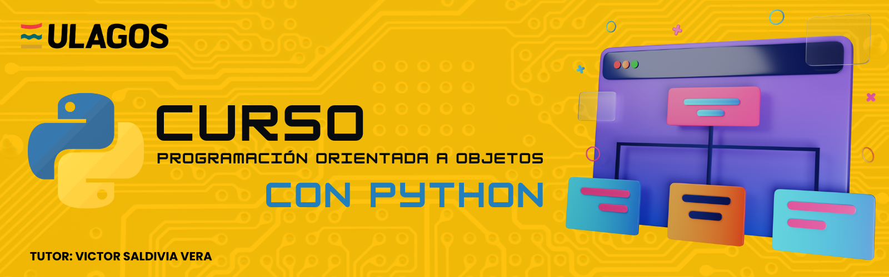

# Repositorio Programación Orientada a Objetos en Python

   
   

Este repositorio está diseñado para introducir y profundizar en los conceptos fundamentales de la Programación Orientada a Objetos (POO) utilizando Python. Dentro de este repositorio, aprenderás a trabajar con clases, objetos, herencia, encapsulamiento, y polimorfismo.

Se van a incluir ejemplos prácticos y ejercicios que te ayudarán a comprender cómo estructurar y organizar el código de manera eficiente utilizando los principios de la POO. Este material está orientado tanto a principiantes que ya tienen una base en Python como a aquellos que desean reforzar sus conocimientos de programación.

Si deseas consultar el repositorio introductorio de Python consulta aquí: [Repositorio Nivel Básico Python][repo-semestre-I]

## Enlaces de Interés

- Web oficial de Python [(Instalacion Python)][python]
- Visual Studio Code [(Editor de Texto)][vscode]

[python]: https://www.python.org/downloads/
[vscode]: https://code.visualstudio.com/download
[repo-semestre-I]: https://github.com/Vikktor93/python-semestre-I
